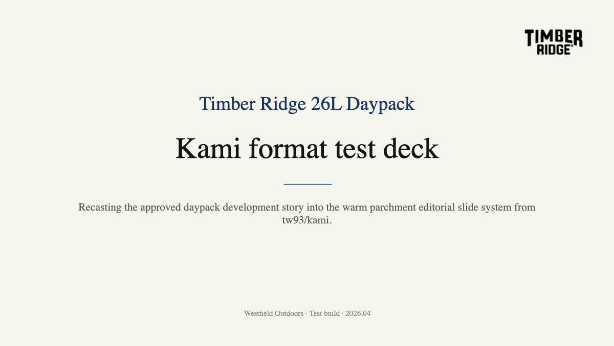

# Timber Ridge Daypack, Kami test

A quick translation of the approved Timber Ridge 26L Daypack development story into the [tw93/kami](https://github.com/tw93/kami) slide aesthetic.

## Files

- [PowerPoint deck](./timber-ridge-daypack-kami-test.pptx)
- [Generator script](./daypack-kami-test.py)
- Preview image:

## Notes

This is a format test, not a replacement for the interactive HTML deck.

Reference deck:
- [Timber Ridge 26L Daypack Development, clean HTML version](../timber-ridge-daypack-development-clean/)
